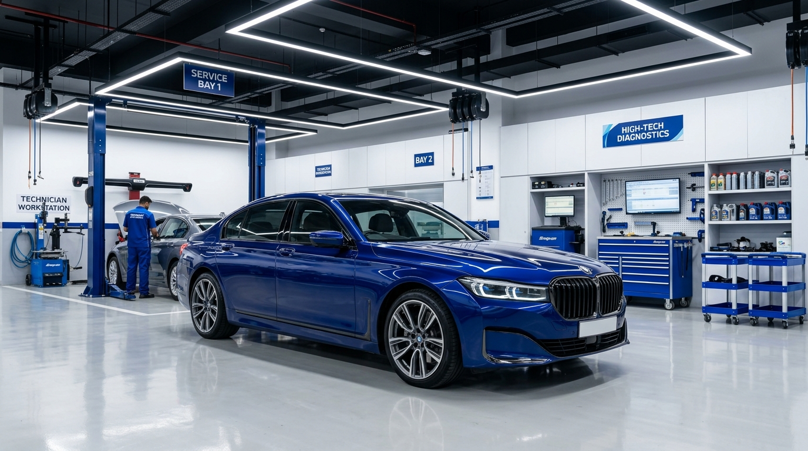

# AutoCare Workshop - Car Workshop Booking Website

A modern, responsive, interactive car workshop service and booking website built with HTML5, CSS3, and JavaScript.



## 📌 Project Details

- **Project Title:** Car Workshop Booking
- **Category:** Web Development
- **Technologies:** HTML5, CSS3 (Vanilla CSS), JavaScript (ES6)
- **Brand:** AutoCare Workshop
- **Tagline:** "Reliable Service. Better Performance."
- **Author / Contact:** Muhammed Ashif T (+91 88488 87954 | mhd.ashift@gmail.com)
- **Location:** Perinthalmanna, Malappuram, Kerala, India

---

## 🚀 Key Features

1. **Sticky Responsive Navigation Bar:**
   - Smooth desktop navigation with active scroll state highlighting.
   - Mobile hamburger toggle menu animated using JavaScript.
   - "Book a Service" quick action button.

2. **Automotive Hero Section:**
   - Catchy heading: *"Your Car Deserves the Best Care"*.
   - High-quality car workshop image with subtle load fade-in animations.
   - Trust indicators: *Professional Service*, *Quality Care*, *Customer First*.

3. **About Section:**
   - Workshop introduction and mission.
   - 3 structured information cards (*01 Quality Service*, *02 Customer Care*, *03 Reliable Support*).

4. **Interactive Services Grid:**
   - 6 Core automotive service cards:
     - General Service
     - Oil Change
     - Brake Service
     - Engine Check
     - AC Service
     - Wheel Alignment
   - **Interactive "Select Service" buttons:** Automatically populates the selected service into the booking form and smoothly scrolls to the form section.

5. **Customer Information & Booking Checklist:**
   - Information cards explaining what customers need before booking (*Vehicle Details*, *Service Requirement*, *Preferred Schedule*, *Contact Details*).

6. **4-Step Booking Process:**
   - Step 1: Choose Service
   - Step 2: Enter Vehicle Details
   - Step 3: Select Date & Time
   - Step 4: Submit Request

7. **Why Choose AutoCare:**
   - 4 Feature cards showcasing *Experienced Service*, *Transparent Information*, *Convenient Booking*, and *Customer Focused*.

8. **Car Service Advice:**
   - Simple, practical tips for car care (*Check Engine Oil*, *Check Tyres*, *Brake Awareness*, *Regular Service*).

9. **Interactive Booking Form with JavaScript Validation:**
   - Input fields: Customer Name, Phone, Email, Car Brand, Car Model, Registration Number, Service Dropdown, Date Picker, Time Dropdown, and Additional Message.
   - Dynamic `min` date setting to prevent selecting past dates.
   - Real-time error clearing and field focus on invalid submit.
   - Regular expressions for email format and 10-digit phone verification.

10. **Booking Confirmation Modal:**
    - Appears seamlessly upon successful form validation.
    - Summarizes request details cleanly: Customer Name, Vehicle Info, Service, Date, Time.
    - Clear wording: *"Booking Request Submitted!"* (Frontend Student Demo).
    - Options to close or book another service.

11. **FAQ Accordion & Contact Section:**
    - Expandable/collapsible FAQ items.
    - Clickable `tel:` and `mailto:` action buttons for immediate contact.

---

## 🎨 Design Theme

- **Primary Color:** Deep Royal Blue (`#0F3854` / `#1E40AF`)
- **Secondary Color:** Bright Orange (`#F97316`)
- **Backgrounds:** White (`#FFFFFF`) / Soft Gray (`#F8FAFC`)
- **Typography:** Plus Jakarta Sans
- **Layout:** Flexbox & CSS Grid, 100% responsive across 320px to 1440px viewports.

---

## 📁 File Structure

```
car-workshop-booking/
│
├── index.html
├── css/
│   └── style.css
├── js/
│   └── script.js
├── assets/
│   ├── hero-car.jpg
│   ├── workshop.jpg
│   ├── service.jpg
│   └── about.jpg
└── README.md
```

---

## ℹ️ Student Project Disclaimer

This project is a **frontend web development demonstration**. It does not process payments or connect to a live backend database. Form submissions trigger client-side validation and display a booking request summary modal.
